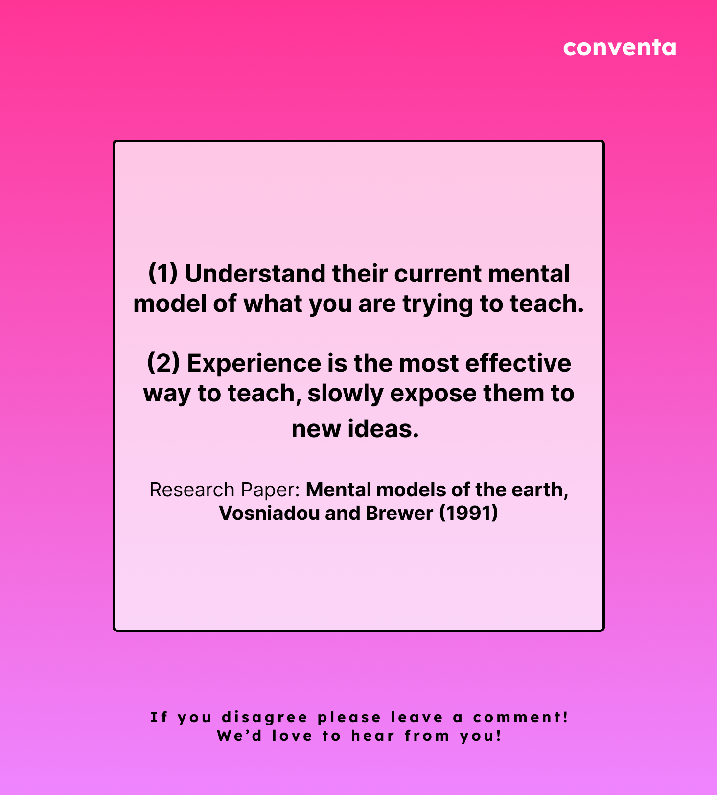

# Conventa Content Generator

[]()
[]()
[]()
[]()
[]()

Welcome to **Conventa Content Generator**, an innovative solution for generating high-quality social media content to market our e-learning platform. **Conventa** is a pioneering e-learning platform aimed at empowering young professionals with essential career skills. Our prime focus is to make learning accessible and engaging, but marketing is just as important. That's where this project comes in. 

We leverage the power of machine learning to create compelling content from our existing courses, allowing us to keep our focus on producing top-tier educational content without worrying about marketing materials. 

Check out the images below for a glimpse of what our Content Generator can do:

<p float="left">
  
   
  
</p>

## Getting Started 

To get started with the **Conventa Content Generator**, follow these easy steps:

### 1. Installation 
Use pip to install the necessary libraries listed in the `requirements.txt` file:

```sh
pip install -r requirements.txt
```

### 2. Configure Tasks
Open the `main.py` file and add tasks as required.

### 3. Run the Program
Execute the `main.py` file:

```sh
python main.py
```

### 4. Review the Output
Navigate to the output directory to view the generated files.

## Contributing
We value all the people who are interested in contributing to Conventa Content Generator. This is required to ensure that this tool can be as effective as possible. 

Enjoy exploring and using the **Conventa Content Generator**! We look forward to hearing your valuable feedback.

## Tags
`#Conventa` `#elearning` `#ContentGenerator` `#Python` `#MachineLearning` `#MarketingAutomation`

> Note: Although this tool is designed with efficiency in mind, keep in mind that you may have to tweak and tune it to your specific needs. And while it's true that nobody might read this, we believe in maintaining a high level of professionalism in all our endeavors. So, here's to creating top-notch, automated marketing content!