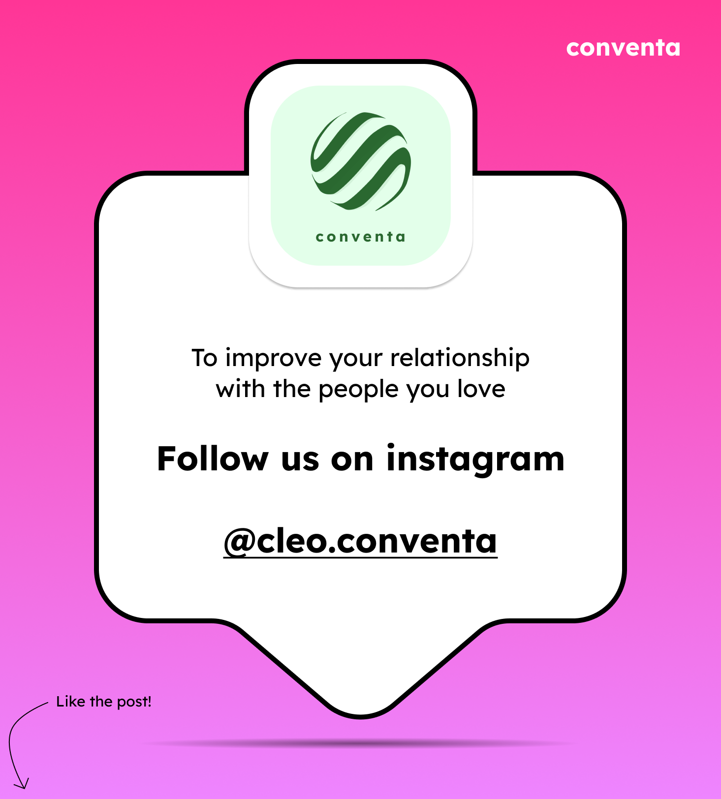

# Content Generation

Okay. New problem. I need to start posting to social media, but surprise surprise
I cannot be bothered to make all the content myself. Now i can pay people to do this 
but fuck that. Honestly. Fuck that. I want a machine to do it for me. 

The plan. I have a basic setup for the content I want to post already, it is simple, minimalistic 
and doesn't require a ton of effort. 

 
 

